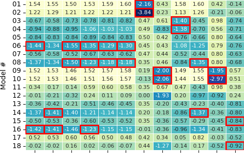
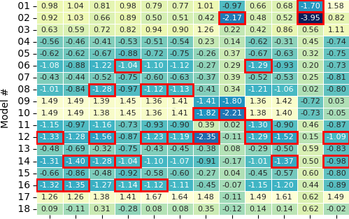
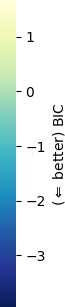
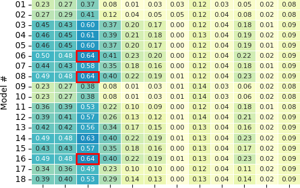
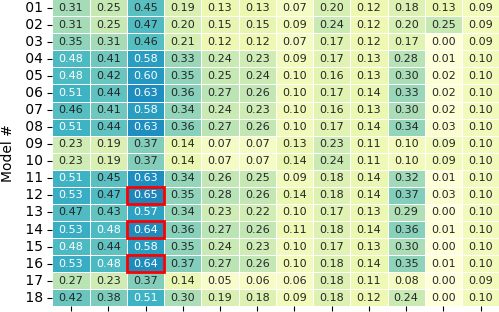
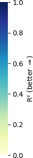
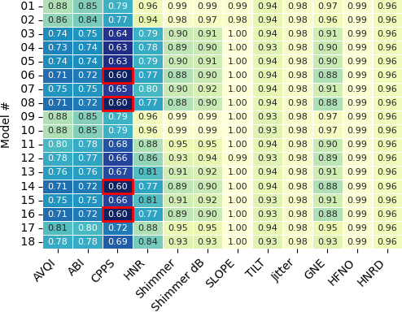
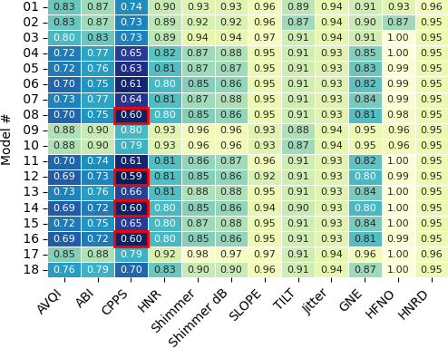
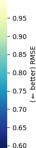

## Measured reverberation times in 35 speech and language therapy rooms
Reverberation times $\tau_{60}$ in 23 third-octave bands from $f_{m_1} = 63\text{ Hz}$ to $f_{m_{23}} = 8\text{ kHz}$ of room acoustic measurements in speech and language therapy rooms, broken down by institution and room number. Reverberation times that fall within the tolerance corridors for rooms with a volume of $V = 30 \text{ to } 80 \text{ m}^3$ in **usage group A3** and **`usage group A4`** according to *DIN 18041:2016-03* are highlighted in color.

|Institution|Room|63 Hz|80 Hz|100 Hz|125 Hz|160 Hz|200 Hz|250 Hz|315 Hz|400 Hz|500 Hz|630 Hz|800 Hz|1000 Hz|1250 Hz|1600 Hz|2000 Hz|2500 Hz|3150 Hz|4000 Hz|5000 Hz|8000 Hz|
|:----|:----|-----:|-----:|-----:|-----:|-----:|-----:|-----:|-----:|-----:|-----:|-----:|-----:|-----:|-----:|-----:|-----:|-----:|-----:|-----:|-----:|-----:|
|1 | 1 | 0.59 | 0.63 | 0.60 | 0.77 | 0.65 | 0.63 | 0.83 | 0.64 | 0.60 | 0.65 | 0.67 | 0.57 | 0.58 | 0.58 | 0.55 | 0.56 | 0.51 | 0.53 | 0.44 | 0.38 | **0.24** |
| | 2 | **0.31** | **0.37** | **0.25** | **0.36** | **0.27** | **0.35** | **0.29** | **`0.23`** | **0.36** | **0.28** | **0.29** | **0.31** | **0.27** | **0.29** | **0.25** | **0.27** | **0.24** | **0.24** | **0.26** | **0.24** | **0.17** |
| | 3 | **0.43** | **0.46** | 0.58 | 0.47 | 0.66 | 0.78 | 0.58 | 0.58 | 0.61 | 0.63 | 0.59 | 0.57 | 0.52 | 0.58 | 0.53 | 0.51 | 0.46 | 0.45 | 0.39 | 0.37 | **0.20** |
| | 4 | 0.61 | 0.59 | 0.61 | 0.82 | 0.74 | 0.83 | 0.83 | 0.75 | 0.75 | 0.83 | 0.75 | 0.73 | 0.64 | 0.64 | 0.57 | 0.56 | 0.49 | 0.49 | 0.48 | 0.41 | **0.24** |
| | 5 | 0.66 | 0.76 | 0.68 | 0.62 | 0.85 | 0.84 | 0.90 | 0.88 | 0.74 | 0.78 | 0.74 | 0.73 | 0.64 | 0.65 | 0.55 | 0.52 | 0.53 | 0.46 | 0.45 | 0.40 | **0.22** |
| | 6 | **0.43** | **0.33** | 0.83 | 0.85 | 0.76 | 0.69 | 0.61 | 0.63 | 0.60 | 0.60 | 0.64 | 0.62 | 0.51 | 0.64 | 0.52 | 0.50 | 0.46 | 0.44 | 0.42 | 0.36 | **0.20** |
| | 7 | **0.41** | **0.44** | **0.40** | 0.56 | 0.45 | 0.42 | 0.69 | 0.63 | 0.53 | 0.52 | 0.52 | 0.45 | 0.47 | 0.53 | 0.45 | 0.42 | 0.41 | **0.36** | **0.33** | **0.30** | **0.21** |
|2 | 1 | **0.24** | **0.31** | **0.32** | **0.34** | **0.29** | **0.27** | **0.30** | **0.27** | **`0.21`** | **0.27** | **`0.24`** | **`0.21`** | **`0.22`** | **`0.22`** | **`0.22`** | **0.25** | **0.24** | **`0.20`** | **`0.18`** | **`0.18`** | **0.16** |
| | 2 | **0.25** | **0.20** | **0.24** | **0.25** | **`0.17`** | **0.27** | **0.25** | **`0.23`** | **`0.19`** | **`0.21`** | **`0.16`** | **`0.16`** | **`0.18`** | **0.29** | **`0.19`** | **`0.22`** | **`0.21`** | **`0.20`** | **`0.16`** | **`0.15`** | **`0.13`** |
| | 3 | **0.16** | **0.28** | **0.26** | **0.23** | **`0.21`** | **`0.18`** | **`0.22`** | **`0.23`** | **`0.23`** | **0.24** | **0.27** | **`0.20`** | **`0.18`** | **`0.22`** | **`0.20`** | **`0.20`** | **`0.20`** | **`0.20`** | **`0.18`** | **0.19** | **`0.14`** |
| | 4 | **0.36** | **0.43** | 0.47 | 0.57 | 0.44 | 0.51 | 0.39 | 0.45 | 0.39 | 0.46 | 0.38 | 0.41 | 0.39 | 0.37 | **0.35** | **0.35** | **0.35** | **0.35** | **0.35** | **0.34** | **0.21** |
| | 5 | **0.40** | **0.37** | **0.41** | 0.54 | 0.57 | 0.46 | 0.46 | 0.61 | 0.59 | 0.68 | 0.64 | 0.67 | 0.66 | 0.61 | 0.58 | 0.57 | 0.59 | 0.61 | 0.63 | 0.57 | **0.32** |
| | 6 | **0.39** | 0.53 | **0.31** | **`0.19`** | 0.42 | 0.50 | 0.36 | **0.35** | 0.50 | 0.49 | 0.46 | 0.45 | 0.52 | 0.50 | 0.48 | 0.47 | 0.45 | 0.47 | 0.47 | 0.43 | **0.24** |
| | 7 | **0.28** | **0.39** | **0.45** | 0.48 | 0.48 | 0.60 | 0.47 | 0.47 | 0.50 | 0.58 | 0.50 | 0.54 | 0.53 | 0.47 | 0.50 | 0.53 | 0.51 | 0.50 | 0.50 | 0.49 | **0.28** |
| | 8 | **0.47** | **0.41** | **0.29** | 0.62 | **0.38** | 0.45 | 0.38 | 0.46 | 0.52 | 0.50 | 0.49 | 0.43 | 0.49 | 0.48 | 0.44 | 0.45 | 0.44 | 0.40 | 0.38 | 0.38 | **0.23** |
|3 | 1 | 0.59 | 0.53 | **0.37** | 0.47 | 0.45 | 0.41 | 0.49 | 0.52 | 0.57 | 0.59 | 0.46 | 0.46 | 0.46 | 0.49 | 0.46 | 0.43 | 0.37 | **0.33** | **0.32** | **0.32** | **0.20** |
| | 2 | **0.28** | **0.45** | **0.35** | **0.31** | 0.48 | 0.43 | 0.55 | 0.44 | 0.44 | 0.42 | 0.42 | 0.43 | 0.42 | 0.38 | 0.43 | 0.44 | 0.42 | 0.43 | 0.39 | 0.39 | **0.23** |
| | 3 | **0.44** | **0.36** | **0.43** | 0.46 | 0.49 | 0.49 | 0.48 | 0.51 | 0.53 | 0.48 | 0.46 | 0.42 | 0.48 | 0.44 | 0.48 | 0.47 | 0.48 | 0.47 | 0.46 | 0.43 | **0.25** |
| | 4 | **0.37** | 0.52 | **0.43** | 0.58 | 0.59 | 0.48 | 0.62 | 0.64 | 0.65 | 0.59 | 0.61 | 0.60 | 0.64 | 0.57 | 0.64 | 0.63 | 0.59 | 0.57 | 0.56 | 0.49 | **0.30** |
|4 | 1 | **0.29** | **0.38** | **0.35** | **0.29** | **0.36** | **0.27** | **0.28** | **0.31** | **0.32** | **`0.24`** | **0.25** | **0.26** | **0.28** | **0.34** | **0.24** | **0.30** | **0.32** | **0.34** | **0.34** | **0.33** | **0.19** |
| | 2 | **0.34** | **0.38** | **0.39** | **`0.20`** | **0.27** | **`0.22`** | **`0.24`** | **`0.20`** | **`0.17`** | **`0.17`** | **`0.23`** | **`0.22`** | **0.28** | **0.33** | **0.25** | **0.27** | **0.25** | **0.27** | **0.31** | **0.31** | **0.18 |
|5 | 1 | 1.37 | 1.93 | 1.68 | 1.96 | 1.56 | 1.31 | 1.52 | 1.29 | 1.40 | 1.43 | 1.34 | 1.35 | 1.30 | 1.27 | 1.25 | 1.23 | 1.18 | 1.11 | 0.88 | 0.78 | **0.33 |
| | 2 | **0.41** | **0.42** | 0.58 | 0.56 | 0.60 | 0.75 | 0.62 | 0.69 | 0.67 | 0.65 | 0.67 | 0.74 | 0.71 | 0.75 | 0.70 | 0.60 | 0.66 | 0.65 | 0.64 | 0.56 | **0.26 |
| | 3 | 0.72 | **0.34** | 0.64 | 0.63 | 0.66 | 0.77 | 0.70 | 0.70 | 0.84 | 0.74 | 0.81 | 0.82 | 0.85 | 0.79 | 0.76 | 0.77 | 0.70 | 0.69 | 0.66 | 0.57 | **0.25 |
|6 | 1 | 0.54 | **0.42** | **0.38** | 0.45 | 0.45 | **0.38** | 0.47 | 0.38 | **0.27** | **0.32** | **0.27** | **0.29** | **0.35** | 0.40 | **0.34** | **0.34** | **0.35** | **0.34** | **0.35** | **0.33** | **0.23 |
| | 2 | **0.48** | **0.38** | **0.35** | **0.29** | 0.44 | 0.42 | 0.45 | **0.34** | **0.30** | **0.27** | **0.28** | **0.28** | **0.30** | **0.33** | **0.33** | **0.34** | **0.36** | **0.34** | **0.30** | **0.34** | **0.23 |
| | 3 | **0.40** | **0.29** | **0.33** | **0.26** | 0.43 | **0.31** | **0.30** | **0.27** | **0.28** | **0.29** | **0.28** | **0.33** | **0.28** | **0.29** | **0.25** | **0.26** | **0.28** | **0.28** | **0.30** | **0.30** | **0.21 |
| | 4 | **0.36** | **0.29** | **0.24** | **0.23** | **0.31** | **0.30** | **0.34** | **0.29** | **0.29** | **0.27** | **0.25** | **0.27** | **0.25** | **0.24** | **0.28** | **0.32** | **0.32** | **0.35** | **0.35** | **0.33** | **0.21 |
| | 5 | **0.40** | **0.30** | **0.32** | **0.21** | **0.39** | **0.35** | 0.40 | 0.37 | 0.44 | 0.39 | 0.38 | **0.36** | **0.30** | **0.30** | **0.28** | **0.31** | **0.33** | **0.32** | **0.35** | **0.34** | **0.21 |
|7 | 1 | **0.43** | **0.28** | **0.36** | **0.32** | **0.26** | **`0.18`** | **`0.11`** | **0.30** | **`0.14`** | **`0.09`** | **`0.08`** | **`0.10`** | **`0.08`** | **0.35** | **`0.13`** | **`0.14`** | **`0.05`** | **`0.06`** | **`0.07`** | **`0.05`** | **`0.06`** |
| | 2 | **0.28** | **0.36** | **0.34** | **0.24** | **`0.21`** | **0.26** | **`0.13`** | **`0.19`** | **`0.13`** | **`0.09`** | **`0.10`** | **`0.13`** | **`0.13`** | **`0.13`** | **`0.12`** | **`0.15`** | **`0.09`** | **`0.10`** | **`0.10`** | **`0.08`** | **`0.10`** |
| | 3 | **0.34** | **0.26** | **0.28** | **`0.15`** | **`0.19`** | **`0.16`** | **`0.15`** | **`0.15`** | **`0.08`** | **`0.11`** | **`0.11`** | **`0.11`** | **`0.10`** | **`0.19`** | **`0.15`** | **`0.13`** | **`0.09`** | **`0.08`** | **`0.08`** | **`0.07`** | **`0.08`** |
|8 | 1 | **0.28** | **0.34** | **0.29** | **0.23** | **0.29** | **0.26** | **0.29** | **0.36** | **0.27** | **`0.21`** | **0.28** | **0.26** | **0.30** | 0.42 | **0.31** | **0.29** | **0.30** | **0.26** | **0.30** | **0.30** | **0.25 |
| | 2 | **0.31** | **0.39** | **0.29** | **0.26** | **0.31** | 0.50 | **0.27** | 0.44 | **0.36** | **`0.22`** | **`0.24`** | **0.26** | **0.27** | **0.31** | **0.34** | **0.35** | **0.34** | **0.36** | **0.36** | 0.37 | **0.22 |
| | 3 | **0.24** | **0.18** | **0.28** | **`0.17`** | **0.24** | **`0.21`** | **`0.20`** | **`0.21`** | **`0.21`** | **`0.24`** | **`0.14`** | **`0.16`** | **`0.14`** | **`0.23`** | **`0.16`** | **`0.16`** | **`0.17`** | **`0.17`** | **`0.18`** | **0.19** | **`0.15`** |

## Measured reverberation times in 35 speech and language therapy rooms
Evaluation metrics *BIC*, $R^2$, and *RMSE* for various statistical linear mixed-effects models based on twelve objective vocal quality measures using recordings captured with lavalier (left) and smartphone (right) microphones. For *BIC*, the two best values per column (or more, in the case of ties) are highlighted; for $R^2$ and *RMSE*, the three best overall values (or more, in the case of ties) are emphasized.

|<!-- -->|<!-- -->|<!-- -->|
|:----|:----|-----:|
| <em>BIC</em> results for lavallier| <em>BIC</em> results for smartphone microphone||
| <em>R</em>2 results for lavallier microphone| <em>R</em>2 results for smartphone microphone||
| <em>RMSE</em> results for lavallier microphone| <em>RMSE</em> results for smartphone microphone||
